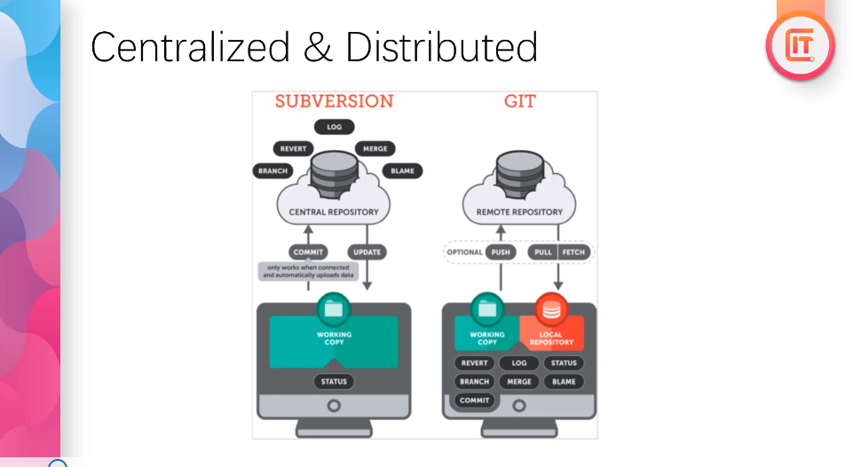
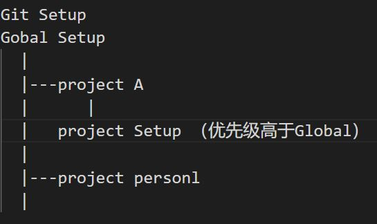
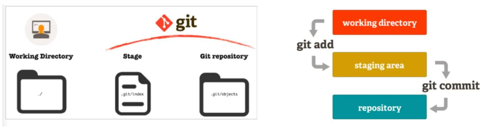

# Git
## Description
本篇笔记以Ray老师的 Lecture 06 Git 为框架，根据W3school进行补充，旨在辅助21期全栈视频，帮助同学建立起基本的学习框架。
## 目录
- [1. 为什么要使用 Version Control](#1-为什么要使用-version-control)
- [2. Centralized & Distributed Version Control](#2-centralized--distributed-version-control)
- [3. Git 和 GitHub](#3-git-和-github)
- [4. 如何设置Git](#4-如何设置git)
- [5. Branch and Merge](#5-branch-and-merge)
- [6. 远程协作](#6-远程协作)
## 1. 为什么要使用 Version Control
1. 历史记录和回溯
2. 协同工作 
3. 备份和恢复 
4. 撤销改动或者回滚版本
5. 分支和合并 
6. 版本标记 
7. 利用分支实验和尝试新功能 

## 2. Centralized & Distributed Version Control



### 2.1 集中式（subversion为代表）
工作文件全部存在central repository, 工作人员把需要工作的文件从central repository中下载了下来，更新修改并完成提交（`commit`）; 这位工作人员在本地的文件只有download下来修改的文件
 - 起源：传统软件开发公司中，因为不是开源，source code都在公司的 central repository, 你的工作需要哪部分，才能下载那部分代码，本地修改完成
 - 同样提供了各种版本控制功能：
    - Log:提供历史记录
    - Merge:文件合并
    - Revert:版本回滚
    - Branch:版本分支
### 2.2 分布式（git为代表）
- Open Source 开发中，没人愿意去设置一个central repository, 于是就有了一个remote repository; 在本地有一个local repository, 也不再是working copy, 而是一个完整的repository。 通过`pull`/`fetch`会拿到remote repository的完整文件, 包含完整的log；通过`push`提交修改过的文件  
- 分布式version control：没有一个集中式的server，在本地就有一个完整的repository  
- 现在大公司也开始逐渐迁移项目到git上

## 3. Git 和 GitHub
GitHub提供了一个第三方的免费的开放式的托管平台，对于其他developer都是一个remote repository
- 同时可以在上面进行：review, discussion, pull request, publish project  
- Github免费平台并不意味着完全免费
  - 免费对象：small business(open source software), open source project, personal; 
  - 收费对象：private, enterprise，integration（功能）  
- （repository）owner会对repository有管理权；每个参与者会有一个local repository, 同时跟remote repository有sync关系（download下来又推上去）

GitHub的其他功能：
  - GitHub Copilot 是由 GitHub 与 OpenAI 合作开发的人工智能编码助手，需要付费。
  - Advanced Security 代码的静态扫描，动态分析，漏洞弱点扫描等
  - Actions 可以做 Devops 的 CI/CD Pipline
> Git是一个CLI工具，命令行工具
> - 但Git也有各种各样的图形界面化工具，也叫GUI。其实工作中不需要，vscode可以安装GUI插件，也很好用。

## 4. 如何设置Git
查询安装的Git版本：  
`git --version ` 
> 不一定需要安装最新版，只要保持最新的major version就可以，前两位保持一致就可以

### 4.1 基本的 Git Setup  
- Global Setup  
  - `git config --gobal user.name "<Full Name>"`   - Deveoper's Real Name
  - `git config --gobal user.email "<email>"`  
    - 在工作中使用公司邮箱
    - 个人项目使用注册GitHub的邮箱
  - `git config --gobal color.ui auto`   
  - `git config --gobal merge.conflictstyle diff3`  
  - `git config --gobal core.editor "code --wait"` 
    - 告诉 editor 使用的是什么IDE, code代表VScode 
    - 配置完成code后，可以直接通过命令
  `code .`来在IDE中打开当前目录
  - `git config --list --global` - 查看config list
  > Git默认使用的就是global setup
- Project Setup
  - 当config时如果不使用 --global 时，设置的就是project setup
  - project setup 优先级高
  
> 如果Mac版本code命令不工作，可以参考 :https://code.visualstudio.com/docs/setup/mac#_launching-from-the-command-line

### 4.2 创建 Local Repository  
使用命令
- `git init`
  - 将当前文件夹变成一个git repository, 让Git去tracking changes
  - 不要手动更改 .git 文件夹
- `git clone` (只有拉取remote repository时才有用)
### 4.3 Git 的工作流程
本地commit (也叫checkin)：分为两步

- Step one: stage  
  - 命令行工具
    - stage: `git add <filename>`
    - unstage: `git rm --cached <filename>`
      - --cached: 这个选项告诉 Git 只要从暂存区（Index）中删除文件，而不删除工作目录中的实际文件。
      - 如果不使用 --cached，git将不再track文件，一般来说不太用得上
    - 使用 `git status` 查看本地库状态 untrack 或 modified的文件
  - 也可以在 VS Code 左侧的 Source Control 面板查看和操作 git stage。文件后大写字母，表示的文件状态为  
      - U - Untracked  
      - A - Add 
      - M - Modified  
- Step two: commit
  - 命令行工具
    - `git commit -m "message"`
      > message必须写，并且要具有意义
    - `git log` 用于显示 commit history
    > Question：`git commit` 以后就不能rm是吗？  
    Answer：是的
  - 也可以在 VS Code 左侧的 Source Control 面板查看和操作 git commit。

> 好用的 VScode Git 插件  
https://marketplace.visualstudio.com/items?itemName=donjayamanne.githistory

### 4.4 `Git stash` 命令
`git stash` 临时暂存区，不会进入verson control history
  - `git stash list` - 查看stash列表
  - `git stash pop` - 取最近的stash
  - `git stash apply <编号>`
> stash 用在 commit 之间，写了但又没到 commit 的程度时的 snapshot

### 4.5 Undo Change

- `git checkout .` 把本地工作目录还原到最新的版本 
  - 也可以使用 vscode 图形化界面里的 discard
- `git clean` 把不存在在历史文件中的新增的文件全部删掉，会报错，：refuse to clean，必须要进行强制操作。
  - 所以使用 `git clean -f` 强制清除
- `git revert` 回滚，revert 会记录下回滚的动作，产生新的 commit , 所以可以使用。
  - `git revert <SHA>`
  - revert 可以 revert revert
- `git reset` 回滚，公司不允许，自己本地的有权限，会从历史记录中删除commit。
  - reset 不是 reset 掉某一条，而是 reset 到目标状态
  - `soft reset` - reset 掉的内容 放到 working folder 下
      > `git reset` 默认就是 `soft reset`
  - `hard reset` - 相反

> `git push`时候如果不想 push 现在 commit 的版本，那我就必须用刚刚 undo 几种办法回滚到想 commit 的版本再 push  
> 本地 revert 的记录会被上传到远程库  
> 本地 reset 的记录不会被上传到远程库
### 4.6 一些其他命令
生成文字或图形化log记录
- 文字： `git log`
- 图形化：`git log --all --decorate --oneline --graph`

使用 `git diff <SHA> <SHA>` 对两个版本进行比较
- 一般进行图形界面进行比较
- 可以进行 git blame，去寻找别人代码的问题
  - 代码可以直接右键，然后 view file history 或 view line history


## 5. Branch and Merge
### 5.1 创建 Branch:
- `git checkout -b <branchName>`

  > 每一个新的 work item/ticket 都需要一个新的 branch 

  > Everyone use different branch

  > 拉取别人 branch 的代码，而不是使用别人的 branch

  > branch 命名是meaningful的。Naming convention: 遵循公司的命名规范  
  > 举例：`<ticket>/<ticket-number>-<title>`  
  > 举例：`feat/JR-101-create-for-home-page`

切换 branch
- `git checkout <branchName>`

删除 branch
- `git checkout -D <branchName>`
  > 在公司只创建 branch 不删除 branch  

### 5.2 Merge

merge from - `git merge <branchName>`

> 因为每天都有人提交代码，所以每天上班都从master branch拉取最新的代码，并merge到自己的branch上，然后开始工作，这样才不会冲突并基于最新的代码。
>  - 有时候拉取的时候conflict就会发生
>  - 如果出现conflict, 就要做resolving
>  - 所以要少量少量不断提交，不要做大的变更再提交

> 帮助理解 git 的模拟工具：https://git-school.github.io/visualizing-git/#free


## 6. 远程协作
### 6.1 Pull 和 Push
一般公司的repository已经存在，所以一般将remote repository的内容clone到本地：
- `git clone <url>`
  > 不要在 git 目录里 `clone` 或 `git init`, 不要形成嵌套的 git

- 使用 `git remote -- verbose` 打印详细信息
  > default 的 remote 就叫 origin  
  > 现在工作中origin可以来自于Github，有的公司里可能用到自建的Git Server

- Publish Branch：将本地创建的branch推送到remote
- Fetch: pull metadate but not sync 看看本地和remote有什么差异，不做修改
- VScode中 sync changes 等于 pull and push

把自己 branch 里的 code 提交到 master branch 里
- Pull Request（PR）
  > Description 可以写 Markdown  
  > 公司一般 template  
  > 一般有 review and text，test csd, code quality
可以指定 reviwer
  > review 完以后一般是 branch 的 owner 自己点 rebase and merge，也有的时候是 reviewer 点


### .gitignore 文件
```
 *.mp3
 *.mp4
 *.dll
 *.dov
 *.docx
 *.xlsx
 *.pptx
 */lib/*
 */bin/*
 .DS_Store
```
> GitHub上有模板

### Rebase and Merge
 Merge 会产生很多线
 Rebase 只产生一条线

### 本地reset了以后push可能会被reject
`git push -f` 强制 push
 - 一般不要用

 