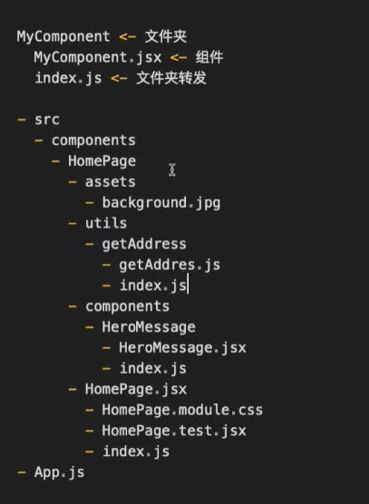

# Lecture 11 React（3）

## Description
本篇笔记以 Zhao Long 老师的 Lecture 11 React (Part 3) 随堂笔记
## Table of Content
- Table of Content
  - [复习](#1-复习)
  - [JSX中的条件渲染](#2-jsx中的条件渲染)
  - [变量注入](#3-变量注入)
  - [组件](#4-组件)
  - [命名规范](#5-命名规范)
  - [路径结构](#6-路径结构)
  - [高阶组件](#7-高阶组件)
  - [Props](#8-props)
  - [补充](#9-补充)
## 1 复习
- 为什么使用JSX
  - readable and maintainable，可以同时写JS和HTML语法
  - 组件化
  - 声明式
- map 中的 key, 使用独一无二的 key
## 2 JSX中的条件渲染
- 在JSX中使用条件渲染时，首推三元表达式，因为：
  - 更可读
  - 符合人类思考方式
  - 因为我们想要在网页呈现的就是这种结果
  - 声明式
> 不要说 看上去简洁，代码中的 clean 是另一个概念，并不是指代码写的简洁
  ```jsx
  // code example User Login
  function WelcomeMessage() {
    return ( 
      <div>
        {isUserLoggedIn
          ? <h1>Welcome back!/h1>
          : <h1>Please sign up.</h1>}
      </div>
    );
  }
  ```
  ```jsx
  // code example：如果用户不是 VIP，就渲染 1s变强，点这里
  {isVIP ? null : <a href="/become-a-vip">1s变强，点这里</a>}
  // 优化为下面的代码
  {!isVIP && <a href="/become-a-vip">1s变强，点这里</a>}
  ```
- 逻辑运算；
  - `{a&&b}`
    - 如果a为trusy返回b
    - 如果a为falsy返回null
  - `{a||b}`
    - 如果a为trusy返回a
    - 如果a为falsy返回b
  - `{a??b}` 空值合并运算符（nullish coalescing operator）
     - a 不是 null 或 undefined，则返回 a；
     - a 是 null 或 undefined，则返回 b。
     - 于 `{a||b}` 的区别 是 `0` 和 `""` 空字符串
     ```jsx
     // code example: 根据 有没有充值总金额 渲染 充值入口
      {total || <a>充值入口</a>}
     ```
> reusable 不考虑未来，只考虑当下和过去
## 3 变量注入
- 在 React 中，JSX 变量注入是指将 JavaScript 表达式嵌入到 JSX 中的过程。这使我们能够在JavaScript中使用类似于HTML的写法，大大提高了代码的可读性和可维护性。给我们代码带来了无限的可能。
  - 问题：为什么大大提高了代码的可读性和可维护性？为什么给我们代码带来了无限的可能？
  - 答案：readable, maintainable, declarative. 把HTML这一个Markdown Language变成了可以做逻辑运算的编程语言。
- 在js中()只起到代码分隔的作用
- 所有的falsy值，除了0之外，都会被渲染为空
- number类型，会被渲染为其`.toString()`的结果
- boolean类型，会被渲染为空
- object类型，不可以被作为JSX的渲染内容
- array类型，需要使用map渲染
- `createElement`函数的实现
```js
function createElement(tag, props, ...children) { 
  const element = document.createElement(tag); 
  for (let key in props) { 
      element[key] = props[key];
      }
  children.forEach(child => { 
    element.appendChild( 
      typeof child === 'string' 
      ? document.createTextNode(child) 
      : child ); 
      });
  return element; 
}
```
> 组件后缀名可以写jsx也可以写js，但是jsx更具有可读和可维护性，以区分其他js文件
> 写组件要具有层级划分和就近原则，这样具有可维护性
> index.js 文件作为入口文件进行转发，在引入的时候可以提高可读性
## 4 组件
- 组件是独立的，可复用的代码块，(组件是"最小"责任实现单元)，他们可以嵌套，管理自己的状态，并接受输入的参数
- 核心概念：
  - 封装：单一职责逻辑，并且是封闭的，意味着逻辑对外不可见，
    - single responsibility principle
    - open / close
    > facebook 有 3 万 7 千 多个组件，不需要在乎有多少层组件
  - 可复用
    - 组件可以在不同的环境和上下文中重复使用
  - 组合
    - 嵌套和组合，可以构建出各种各样的应用界面
- 组件化的好处：
  - 模块化
    - 独立模块，简化代码组织和管理
  - 维护性
    - 可复用性提高了维护性
  - 可拓展性
  - 快速开发
    - 组件支持快速开发和迭代
    - 组件可以独立开发和测试
  - 代码复用和团队协作
- 组件分为类式组件和函数组件
  - 类式组件已经不用了，但是工作中有可能需要维护上古代码类式组件
> 问题：为什么需要导入react
> 因为jsx使用了react
> 最新的react不需要显式的引入react
## 5 命名规范
- 命名规范
  - TitleCase
  - kebab-case
  - snake_case
  - camelCase
  - CONST_CASE
- 问题：为什么react组件使用TitleCase
  - 答案：可读性，为了区分 组件 和 标签(HTML Tag)，又保证与HTML相似，让Component可以融合在HTML。
## 6 路径结构

## 7 高阶组件
  - 很多高阶组件的功能被hooks替代
## 8 Props
- React组件的输入，类似于函数的参数
- Props是只读的，保持数据的一致性和可预测性
  - 被调用者不应该修改调用者传递进来的东西
  - 修改Props是不可预测，不可控，不可debug的，也就是不可维护的
- Props 可以传递任何类型的数据
- 可以定义组件应该接受哪些Props的类型和默认值

## 9 补充
> 当和同事出现冲突的时候，要找到相关的理论知识
> react 只有 组件和声明式 没有MVC MVVM
