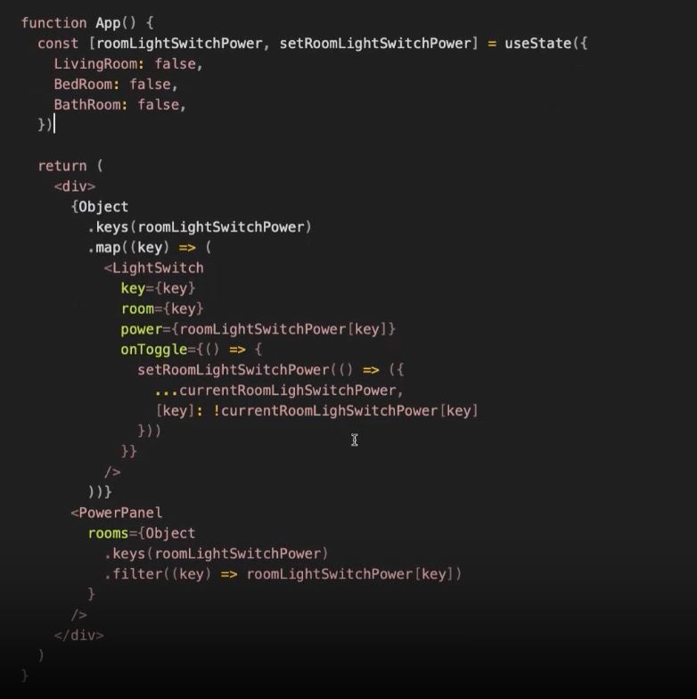
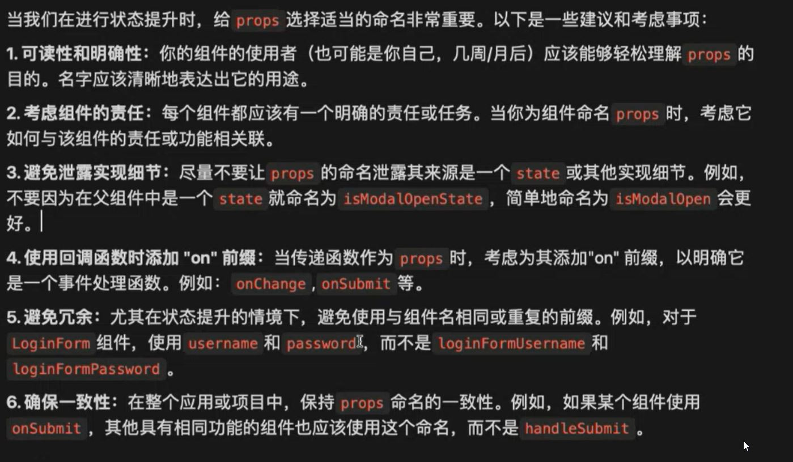

# Lecture 13 React (5)

## Description
本篇笔记以 Zhao Long 老师的 Lecture 13 React (Part 5) 随堂笔记
## Table of Content
- Table of Content
  - [状态 State](#状态-state)
    - [什么是状态](#什么是状态)
    - [react 中的状态](#react-中的状态)
      - [useState](#usestate)
      - [状态合并（同一逻辑的多个状态 ）](#状态合并同一逻辑的多个状态)
      - [状态更新](#状态更新)
      - [什么不是状态](#什么不是状态)
      - [状态的层级不是一定的](#状态的层级不是一定的)
      - [状态提升 - 状态管理的最简单的方法](#状态提升---状态管理的最简单的方法)
  - [补充](#补充)
## 状态 State
### 什么是状态
- 状态是声明式的，是倒推出来的，是结果论的
- 状态举例：
  - 比如电脑有什么状态？
    - 电源状态
    - 显示状态
    - 音量状态
  - 比如水杯有什么状态？
    - 水量状态
    - 清洁状态
    - 水杯的size不是状态，是属性，因为不可以改变
  - 一本书的状态
    - 阅读状态/阅读进度
    - condition
    - ***邮寄状态（一个东西的状态可以不属于他自己，邮寄状态属于在线商城）***
  - 一个屋子 有 四个灯 和 一个电源控制器
    - 灯的电源状态不再属于灯，而是属于屋子 ***（状态提升）***
    - ***状态提升：一个东西的状态被慢慢的提升给这个东西的拥有者，状态不是一成不变的，随着项目越来越大，可以合并和提升，状态的对象可以多层嵌套***
### react 中的状态
#### useState
- 可以设置初始值，但也可以没有初始值
- 状态可以是任意类型, object, string, boolen, number 等
  ```jsx
  import {useState} from "react";
  
  function MyComponent = () => {
    const [counter, setCounter] = useState(0);
    const [name, setName] = useState("Alice");
    ...
  }
  ```
- 对于 array 和 object, 使用 spread 更新状态
- 写好一个状态：状态应该是合理的，可读，可复用，可维护
#### 状态合并（同一逻辑的多个状态 ）
- 案例：一个屋子里的的heater
  - 比如 一个屋子里的 heater 的 power, temprature, fanSpeed状态可以合并为一个 object
    ```jsx
    connst [heater, setHeater] = useState({
      power: false,
      tempurature:16,
      fanSpeed: 0,
    })

    setHeader({
      ...heater,
      power: true,
    })
    ```
    - 状态合并运用了 solid 原则里的 SRP 原则
    - 但不要把 light 放进来，因为责任不一样
- 案例：一个客厅里的所有电器（heater, light 等）
  - 合并所有客厅的状态
  ```jsx
  const [livingRoom, setLivingRoom] = ({
    light: false;
    temperature: 0;
    heater: {
      power: false,
      temperature: 16,
      fanSpeed: 0,
    }
  })
  ```
- 结论：
  1. SRP 是会变的，是从当前的 context 来讲的，状态也不是一成不变的
  2. 随着一个项目越来越大，状态会被慢慢提升出去，被另外一个组件控制
  3. 状态 obejct 可以嵌套
#### 状态更新
- 函数式更新：如果一个状态的更新依赖于前一个状态，必须使用函数式更新， 因为状态的更新是异步的
  ```jsx
  setCount(prevCount => prevCount + 1)
  ```
- `state` 的异步更新，是为了节省性能和不必要的 render，这与 react 的 render 方式有关
- `state` 的作用（任何一个页面上可能发生改变的东西）
  - 用户交互产生的新数据
  - 表单输入
  - 切换状态： 比如一个按钮
  - 来自api的数据一定是状态，因为可能拿得到，可能拿不到，可能正在拿
  - 动画：
    - 比如loading `isLoading`， 
    - 比如 按钮 hover Menu dropdown 
      - 状态为 `isMenuShow`
      - 此时状态不要叫`isHover`，因为hover是过程不是结果
      - 声明式不关心过程关心结果。
#### 什么不是状态
- 不发生改变的数据不是状态，
- 或者发生改变但不导致UI更新的数据
#### 状态的层级不是一定的
- 在其合理合法的情况下，放在最小单元里，
- 并同时遵循单一真实数据来源
- 因为高层级不关心这个状态，放在低层级更好管理
- 比如 
  - 如果只有一个switch开关
    - 则状态放在switch组件里进行管理
  - 如果多个switch开关作为一个list
    - 则应该在共同父组件里管理状态和渲染，可以更好的复用，更容易管理这个list的所有switch的状态，同时避免了 copy and paste
    - 状态合并 和 状态提升  
    
    
#### 状态提升 - 状态管理的最简单的方法
- 当两个或多个组件需要共享同一个状态时，将状态提升到共同的父组件
- 刚开始会把状态放在最小的局部状态，不考虑将来
- 同时，我们应该认同，状态是会发生改变的
- 但随着项目的发展和组件交互的增加，我们可以根据逻辑的需要状态提升 1-n 个层级，只要为了保证单一真实数据来源
- 提升之后 `props` 命名要注意，要注意组件的单一责任和可读性，同一个数据，每一层的 `props` 命名大概率不一样，因为每个组件的责任是不一样的，所以每个 `props` 描述也是不一样的 
- 不要暴漏太多细节
- 避免冗余，保持一致性

## 补充
> react 并不高深，如果写不好是因为 js 没学好

> react 一个组件应该写在 100 行内，如果写太多，应该拆组件

> react 无非就是 声明式 + 组件

> React 哲学

> [State as a Snapshot](https://react.dev/learn/state-as-a-snapshot)