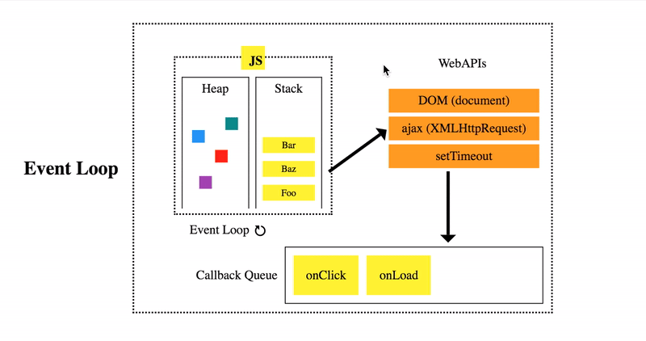

Lecture 14 Node Part 1
## Description
本篇笔记为 Mason 老师的 Lecture 14 Node.js (Part 1) 随堂笔记
## Table of Content
- [Backend Course Structure](#backend-course-structure)
- [What is Node.js](#what-is-nodejs)
- [Event Loop](#event-loop)
- [Architecture](#architecture)
- [Version](#version)
- [Modules](#modules)
- [Built-in Module](#built-in-module)
- [JSON](#json)
- [Code Practice](#code-practice)
- [Debug](#debug)
## Backend Course Structure
  - Node.js basic
  - API & RESTfulAPI
  - NPM & Express.js
  - MongoDB & Mongoose
  - Authorization & Autheticaton
  - Testing
  - Deployment

## What is Node.js
- It is a ***JavaScript runtime enviroment*** built on ***Chrome V8 Engine***(it is not a language)
- It allows developers to use JavaScript to build ***server-side application and API*** rather than just building frontend web
- hig-performance because of ***asynchronous***, ***non-blocking*** nature
- It uses an event-driven model
- by using ***non-blocking I/O operations***, Node.js can handle multiple request simultaneously

## Event Loop
- Asynchronous - non blocking
  - Asynchronous operation is like making a phone call, leaving a message, and continuing with your day while waiting for a callback. You don't wait on the line.
- Synchronous - blocking
   - wait on the line
- JavaScript is single threaded, so it use ***Event Loop*** to enable Asynchronous operation, to make it non blocking and allowing tasks to be processed simultaneously
  > [Event Loop simulator](http://latentflip.com/loupe/?code=JC5vbignYnV0dG9uJywgJ2NsaWNrJywgZnVuY3Rpb24gb25DbGljaygpIHsKICAgIHNldFRpbWVvdXQoZnVuY3Rpb24gdGltZXIoKSB7CiAgICAgICAgY29uc29sZS5sb2coJ1lvdSBjbGlja2VkIHRoZSBidXR0b24hJyk7ICAgIAogICAgfSwgMjAwMCk7Cn0pOwoKY29uc29sZS5sb2coIkhpISIpOwoKc2V0VGltZW91dChmdW5jdGlvbiB0aW1lb3V0KCkgewogICAgY29uc29sZS5sb2coIkNsaWNrIHRoZSBidXR0b24hIik7Cn0sIDUwMDApOwoKY29uc29sZS5sb2coIldlbGNvbWUgdG8gbG91cGUuIik7!!!PGJ1dHRvbj5DbGljayBtZSE8L2J1dHRvbj4%3D)
```js
// Asynchronous - non blocking Code Example
console.log('A')
setTimeout(() => {
  console.log('B')
}, 3000)
console.log('C')
// A
// C
// B
```
- How does setTimeout work?

  1. When ***setTimeout*** is called, the setTimeout function along with its parameters is pushed onto the ***call stack***.

  2. In the browser or Node.js (Web API in browser and Node.js are different), the web API (Thread Pool) begins a countdown of 1000 milliseconds.

  3. The JavaScript engine continues to execute subsequent synchronous tasks until the call stack is empty.

  4. After 1000 milliseconds, setTimeout is placed in the ***Callback Queue （First In First Out）***.

  5. The ***event loop*** checks if the call stack is empty reguarly. If the call stack is empty, meaning all synchronous functions have finished executing, the callback function from setTimeout is executed. Therefore, the final waiting time for setTimeout may be longer than 1000 milliseconds.

      

> In Node.js, in addition to the Callback Queue, there is also a Promise Queue used to handle asynchronous operations based on Promises. The handling of Promises is similar to setTimeout, but the callback functions of Promises are pushed into the Promise Queue rather than the Callback Queue. The event loop first processes the ***microtask queue (such as the Promise queue)***, and then the ***macrotask queue (such as the callback queue)***.

> setTimeout is not always accurate, and how to fix it?

## Architecture


## Version
- LTS - long time support - recommonded
- Current - newest but not reliable

- use nvm if you are using multiple projects built with different Node version or when updating Node versions

## Modules
- ***ES Module*** vs ***CommonJS***
### ES Module
```js
// ES Module

// a.js
export function sum(a, b){}

// b.js
import {sum} from './a' // async loading / non-blocking
// ES Module is good for frontend to improve UX
```

### CommonJS
```js
// CommonJS

// a.js
function sum(a, b){}
module.exports = {sum} // recommended Syntax

// Correct Syntax but not recommended: module.exports.sum = function(){}
// Correct Syntax but not recommended: exports.sum = function(){}
// Incorrect Syntax (x): exports = {sum};

// b.js
const {sum} = require('./a'); // sync loading / blocking
```
> node.js used to only support CommonJS, but starting from node.js v 12, it supports both, However, node.js is still recommended
> think of module as a IIFE(Immediately invoked function expression)
```js
const moduleA = { exports: {} };
(function(__filename, module) {
  let count = 0;
  
  function getCount() {
    return count;
  }

  function increaseCount() {
    count++;
  }

  module.exports = {
    increaseCount,
    getCount,
  }
  
})('/.../.../module.js', moduleA);

moduleA.exports.increaseCount();
console.log(moduleA.exports.getCount());
```

## Built-in Module
### File System 
- import package/module
  - relative path
  - package name
    ```js
    const fs = require('fs')
    ```
    ！[node_fs_read_file_and_write_file](./node_fs_read_file_and_write_file.jpg)
### Http Module
  - Create a server and listen for requests on a specific port
  ```js
  const fs = require('fs');
  const http = require('http');
  const path = require('path');
  
  const server = http.createServer((req, res) => {
    if(req.url === '/'){
      // res.setHeader('Content-Type','text/html');
      // red.end('<h1> Home </h1>');
      
      fs.readFile(path.join(__dirname, 'home.html'), 'utf-8', (error, data) => {
        if(error) {
          console.log(error);
          return;
        }

        res.end(data)
      })
    }

    if(req.url === '/about'){
      fs.readFile(path.join(__dirname, 'about.html'), 'utf-8', (error, data) => {
        if(error) {
          console.log(error);
          return;
        }

        res.end(data);
      })
    }
  })
  
  server.listen(3000, ()=>{
    console.log('server running on port 3000...');
  })
  ```
## JSON
- ***JavaScript Object Notion***
  - similar with JavaScript Object, but doesnt have undefined
  - json file -> server(string) -> JSON.parse(data) -> JS Object -> JSON.stringify()
## Code Practice
  ```js
    const http = require('http');
    const fs = require('fs');

    const notes = require('./notes.json'); // node.js can require json file

    const server = http.createServer((req, res) => {
      if(req.url === '/' && req.method === 'GET') {
        res.end(JSON.stringify(notes));
        return;
      }
      if(req.url === '/' && req.method === 'POST') {
        let body = '';
        req.on('data', (chunk) => {
          body += chunk;
        });
        req.on('end', () => {
          // body -> JSON
          // data <- JS Object
          const data = JSON.parse(body);
          
          notes.push(data);

          // write file with notes
          fs.writeFile('notes.json', JSON.stringify(notes), (err) => {
            if(err) {
              console.log(err);
              res.end('error');
              return;
            }
            res.end('Successfully added note');
          });
        });
      }
    });

    server.listen(3000, () => {
      console.log('server is running on port 3000');
    })
  
  ```
> [chrome json viewer plugin](https://chromewebstore.google.com/detail/json-viewer/gbmdgpbipfallnflgajpaliibnhdgobh
)
## Debug
- console.log()
- VScode Break Point
