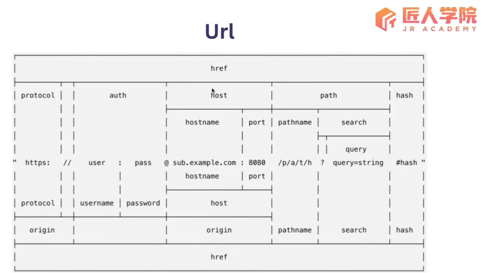
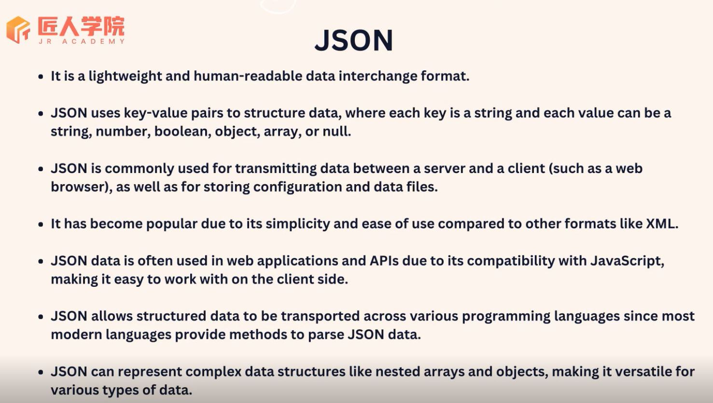
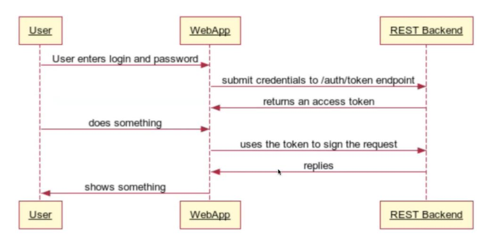

# Lecture 15 Node Part 2
## Description
本篇笔记为 Mason 老师的 Lecture 15 Node.js (Part 2) 随堂笔记
## Table of Content
- [API and RESTful API](#api-and-restful-api)
  - [Protocol](#protocol)
  - [URL](#urluniform-resource-locator)
  - [HTTP Request](#http-request)
  - [HTTP Response](#http-response)
  - [Common HTTP Method](#common-http-method-for-crud)
  - [Common HTTP Headers](#common-http-headers)
  - [Preflight Request](#preflight-request)
  - [Status Code](#status-code)
  - [fire HTTP Request](#fire-http-request)
  - [JSON](#json)
  - [What is API](#what-is-api)
  - [What is REST](#what-is-rest)
  - [Other Web API](#other-web-api)
  - [Authentication and Authorization](#api-authentication-and-authorization)
  - [Code Practice ](#code-practice)
## API and RESTful API
### Protocol
- ***Data Transfer***
  - ***`TCP` (Transmission Control Protocol )***
    - used for transfering data on internet
    - reliable
  - ***`UDP` (User Datagram Protocol)***
    - used for transfering data on internet
    - faster but not reliable, may lose data during data transfer
    - unlike TCP, UDP is normally used for gaming and video 
- ***`IP` (Internet Protocol)***
  - IP divides data into small packets and transmits them as individual units over the network. Each packet includes source and destination addresses, as well as the actual data. 
  - It defines how data packets are encapsulated and addressed within the network, enabling them to be transmitted from the source host to the destination host.
- ***`HTTP` (HyperText Transmission Protocol)***
  - HTTP has 5 versions, we use `HTTP 1.1` version when developing and use `HTTP 2` version when developing
  > `HTTPS` vs `HTTP`: 's' means security
> We use `TCP/IP` and `HTTP`
- OSI (Open Systems Interconnection) Model
  - Physical Layer
  - Data Link Layer
  - Network Layer
  - Transport Layer
  - Session Layer
  - Presentation Layer
  - Application Layer
### `URL`(Uniform Resource Locator)

- example: https://www.example.com:8080
  - `host` = hostname + port = www.example.com:8080
  - `hostname` = www.example.com
  - `domain` = example.com
  - `origin` = protocol + host = https://www.example.com:8080

### HTTP Request
- Request Line 
  - Request Method
  - URL
  - HTTP version（HTTP 1.1 or HTTP 2）
- Header
  - Provide some additional information for the server
  - Case Insensitive
  - Key Value Pair
- Body(optional): data
  - various formats: `JSON`, `XML`, `plain text`, or `form data`
### HTTP Response
- Status Line 
  - HTTP Version
    - HTTP 1.1, HTTP 2 ...
  - Status Code
    - Such as `200`, `404` ...
  - Reason Phrase
    - meta data: additional information about the server's response
- Header
- body(optional)
  - similar with request body

### Common HTTP Method for CRUD
- `GET`
  - Read
- `POST`
  - Create
- `PUT`
  - Update
  - Update whole dataset
  - for small company, it is common to use PUT only rather than using PATCH
- `PATCH`
  - Update
  - Minor Update
- `DELETE`
  - Delete

### Common HTTP Headers
 - User-agent: broswer
 - Accept: Tell the server what data I can identify as a client; in most cases, we don't need to worry about it.
 - Content-Type: tell the reader(server or client) what format the data is 
 - Content-Length: length of data in body
 - Cache-Control 
 - Cookie: Session ID and other information to store user's behavior, we use Token rather than Cookie
 - Authorization: JWT Token
    > keyword: Bear Token, OAuth Token
 - Referer: used for Marketing, record where the user come from.
### Preflight Request
> CORS: Cross Origin Resources Sharing
- settings at server side to return the header
  - access-control-allow-headers
  - access-control-allow-methods
  - access-control-allow-origin

### Status Code
---
- 1xx  Protocol Related
- 2xx  Success
- 3xx  Redirection
- 4xx  Client Error
- 5xx  Server Error
---
- 200 OK	
  - The request is OK (this is the standard response for successful HTTP requests)
- 201 Created	
  - The request has been fulfilled, and a new resource is created 
- 204 No Content	
  - The request has been successfully processed, but is not returning any content
  - fetch again if frontend need new data after deleting data from backend
- 400 Bad Request	
  - The request cannot be fulfilled due to bad syntax
- 401 Unauthorized	
  - The request was a legal request, but the server is refusing to respond to it. For use when authentication is possible but has failed or not yet been provided
- 403 Forbidden	
  - The request was a legal request, but the server is refusing to respond to it
- 404 Not Found	
  - The requested page could not be found but may be available again in the future
- 500 Internal Server Error	
  - A generic error message, given when no more specific message is suitable
  - > we should avoid returning 500 staus code
  - in Development Mode, we should replace 500 with 4xx status code to make it more specific
  - in Production Mode, we should use log and monitoring system to record all the 500 status code and replace 500
- 502 Bad Gateway	
  - The server was acting as a gateway or proxy and received an invalid response from the upstream server
- 503 Service Unavailable	
  - The server is currently unavailable (overloaded or down)

### fire HTTP Request
- curl 
  - `Curl -v https://www.google.com`
  - on linus and mac
- broswer
  - dev tool network
  - normally used for frontend development
- postman
  - normally used for backend development

### JSON
  - JavaScript Object Notion
  
  ```js
  // JSON example
  {
    "a": "string", // both key and value must be wrapped in double qoutation ""
    "b": 1,
    "c": [],
    "d": {} // no trailing comma
    // format could be string,number,boolean,object,array,null
    // but no undefined, otherwise property will be deleted
  }
  ```

### What is API
Through an interface, invoke a specific data, service or functionality according to its prescribed requirements, without needing to know what it is doing internally.
### What is REST
#### REST（Representational State Transfer）
一种用于构建Web API的架构风格，而非具体的规范。它被视为一种最佳实践的建议和指南。
  - 资源划分： REST的设计理念是将API划分为资源，使其更符合现实世界中的实体或数据。
  - 无状态性： REST是无状态的，每次请求都是独立的，不依赖之前的请求，从而保持了简单性和可伸缩性。 
  - HTTP方法对应操作： RESTful API的设计中，HTTP方法（GET、POST、PUT、DELETE等）与所执行的操作一一对应，提供了清晰的语义。
  - 资源格式多样性： 资源可以以不同的格式（如JSON或XML）呈现。
  - 创建统一接口： REST鼓励创建统一的接口，简化API的设计和使用。
  - HATEOAS（超媒体作为应用状态的引擎）： 在实际开发中这一特性并不经常被广泛应用。
> 总结： REST是一种灵活的Web API架构风格，通过资源划分、无状态性、HTTP方法对应操作等原则，提供了一套设计准则，以便开发者构建简单、可伸缩、易于理解和维护的API。

#### RESTful API Versoning
- to ensure a smooth transition between new and old versions.
  ```
  /api/v1/resources
  api/example.com/v1/users
  api/example.com/v2/users
  v1/example.com/api/
  ```
- Using nouns to describe resources, and using plural form
  ```
  /users
  /news
  ```
- Use HTTP methods to perform corresponding operations
  - GET - get data  
  - POST - add data
  - ...  
- nested structure in API 
  - `/users/{userId}/posts/{postId}` 
    - 括号中可以使用变量  
    - 资源后面跟的是某一个具体资源的 Id  
  - `/users/:userId/posts/:postId` 
- Use the appropriate status code to describe the result of the request下·
  - 200 -> ok
  - 201 -> created
  > 并不是所有成功的请求都返回200，应该进行区分
- 通过Pagination 控制返回数据的大小  
Example：  
  > 一次返回一页，每页包含10或100个用户   
  > 使用以下请求进行分页：
  >   - GET /users?page=1&pageSize=10  
  >   - GET /users?page=1&pageSize=100  
  (path -> query -> query prama)
  ```
  400
  {
    error: "Invaild password format, expecting at least one lower case"
  }
  ```
  > 返回固定/统一格式的错误对象，增加课拓展性
  ```js
  { // default
    data:xxx
    error:xxx
  }
  { //success
    data:xxx
    message:xxx
    pagination:xxx
  }
  { // fail
    error:xxx
  }
  ```
> The backend should redefine errors and avoid returning the original error object and error message to the frontend.
  
### Other Web API
1. SOAP - Used for communications requiring high security, such as in banking or government
2. GraphQL - It allows clients to request only the data they need, making it more efficient and flexible compared to traditional RESTful APIs
3. WebSocket - Real-time communication, for example, in chat applications or push notifications
4. gRPC - used in large companies, developed by Google

### API Authentication and Authorization
#### Introduction
- Authentication
  - Who are you  
- Authorization
  - What can you do
- User logs in, and the backend returns a token that specifies:
  1. User permissions
  2. User's roles
  3. personalized settings

sequence diagram 

### Code Practice 
- use Postman to send request to News API 
> setup collection and environment in Postman


