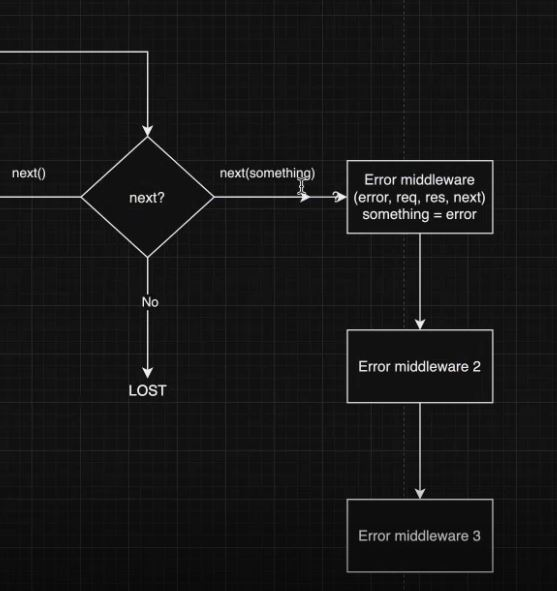

# Lecture 16 Node Part 3

## Description
本篇笔记为 Mason 老师的 Lecture 14 Node.js (Part 1) 随堂笔记

## Table of Content
  - [1. NPM - Node Package Manager](#1-npm---node-package-manager)
  - [2. Using NPM](#2-using-npm)
  - [3. Creating a server using server.js](#3-creating-a-server-using-serverjs)
  - [4. dependencies](#4-dependencies)
  - [5. Express.js](#5-expressjs)
  - [6. Middleware](#6-middleware)

## 1. NPM - Node Package Manager
It is the largest software registry in the world, where packages can be shared and borrowed.

### 1.1 How to Understand and Select a Package
- Does it support TypeScript?
  - If it doesn't, you'll need to write a declaration file yourself.
- Version and Published Time: Check to see if the package is actively maintained, although this should be used as a reference only.
- README: Treat it like documentation. Always read the README to understand if it has the necessary functionalities needed for your project and experiment with it in a sandbox before integrating it into your project.
- Open Source and Contribution
- Dependencies and Dependents
- Installation
- Where Is the Source Code Located?
  - Most packages are stored in GitHub repositories: 
    - forks, stars, issues and replies, pull requests and approvals, and community: Check to see if the package is actively maintained.
- Weekly Downloads: This can give an indication of the package's activity level, although it should be used as a rough estimate only.
- License
  - MIT is the most permissive license and can be used in any project.
  - Some licenses may restrict usage to non-profit projects, so it's important to pay attention to this.

## 2. Using NPM

###  2.1 Initialization
- `npm init`; or 
- `npm init -y` automatically answers yes to all setup questions.

### 2.2 Install package
- `npm install` or
- `npm i`

### 2.3 package.json and package-lock.json
- package.json
  - Records the version of the package you installed.
- package-lock.json
  - Records the version of the package you installed and its dependencies.
  
### 2.4 node_modules
- Includes packages and dependencies tailored for your operating system.
- Therefore, cloud-based projects do not include node_modules.
  - Use a `.gitignore` file to configure and prevent the `node_modules` directory from being uploaded to the repository (`node_modules/`).
- After pulling files from the cloud, use `npm install` or `npm i` first. npm will then install the corresponding packages based on `package.json` and `package-lock.json`.

## 3. Creating a server using server.js
```js
const express = require('express');
const app = express();

app.use('/', (req, res) => { // route: '/' equals '' in express.js
  res.send('hello, world');
})

app.listen(3000, () => {
  console.log('Server running on port 3000');
})

```
## 4. dependencies
### 4.1 Sematic Version
```json
"dependancies": {
  "express": "^4.16.4"
}
```
```
// major(break change).minor(feature change).patch(bug fix)

// the signal before version in package.json, for example "^4.16.4":
// ^          fix major version
// ~          fix major and minor version
// no signal  fix major, minor and patch version
```
### 4.2 Installing Specific Versions of Packages
```js
npm install express@3

npm install express@latest // to fix vulnerabilities
                           // read document before update
npm audit fix // to fix vulnerabilities
npm outdated // to check update
npm uninstall express // to delete package

npm i @mui/material // namespace
npm i @mason/express // namespace
npm i @types/express // defination / namespace
```

### 4.3 devDependencies  
```js
npm i nodemon --save-dev
npm i nodemon -D // abbreviation
// for dependencies used in development but not needed in production 
```

### 4.4 Global Dependencies
- This approach is not recommended.
- Because it requires frequent updates to the package.
- you can use `npx` instead, which allows you to use the package without downloading and installing the latest version.
- also globally or `npx` installed package will not be recorded in package.json

### 4.5 scripts in package.json
Custom scripts: Before proceeding, check if the packages in our node_modules directory support the shortcut command we've set. If available, npm will utilize it directly.
- package.json
```json
"scripts": {
  "dev": "nodemon index.js " 
}
```
sometimes:  需要添加一些很长的参数，所以使用快捷命令很方便
- cli
`npm run dev`

## 5. Express.js
Express.js is a fast, unopinionated, minimalist web framework for Node.js.

Other popular frameworks include:
- Koa.js
- Fastify
- Loopback.js
- KeystoneJS
- Nest.js

routes:
```js
const express = require('express');
const app = express();

//method, route, route handler
app.get('/', (req, res) => { 
  res.status(200).send('hello, world'); // return string/html/json
  // express does JSON.stringify, so no need to do that
  // recommend using 'res.json()' instead of 'res.send()'
})

// app.use();     // can match all method
// app.all();     // similar with use but rarely used

// app.post();    // match specific method
// app.delete();
// app.put();
// app.patch();

// route params
app.get('/uses/:id/posts/:postId', (req, res) => { 
  const {id, postId} = req.params;
})

// get data from a http request
// 1. req.params(url中的变量) GET/POST/PUT/DELETE
//      /users/:id
// 2. req.query(query中的变量 query params) GET
//      /users?page=1
// 3. req.body  POST/PUT/DELETE
// 需要使用 app.use(express.json())中间件，express.json()会帮我们将request里的body数据(json)转换为js object，并赋值req.body
// 4. from headers (authorization)
//      token

app.listen(3000, () => {
  console.log('Server running on port 3000');
})

```
- delete, no content return
```js
res.sendStatus(204)
// delete, no content return
```
## 6. Middleware
- A middleware function is a function that can access req, res, and next in request-response cycle
  - It can excute any code
  - It can make changes to the request and response objects
  - It can end the request response cycle
  - It can call the next middleware function in the stack，to invoke the next middleware function
    - if the current middleware function does not end the request-response cycle, it must call next() to pass control to the next middleware function. Otherwise, the request will be left hanging.

- Node.js backend is a series of middleware function calls

- error handling

- path not found
  - If next() is called, but the next middleware does not exist:
    - It defaults to the Express behavior of entering the "404 Page Not Found" route.
    - During development, it can be managed or left unhandled as desired.
- router
  - `app.use('v1/users', userRouter)`
